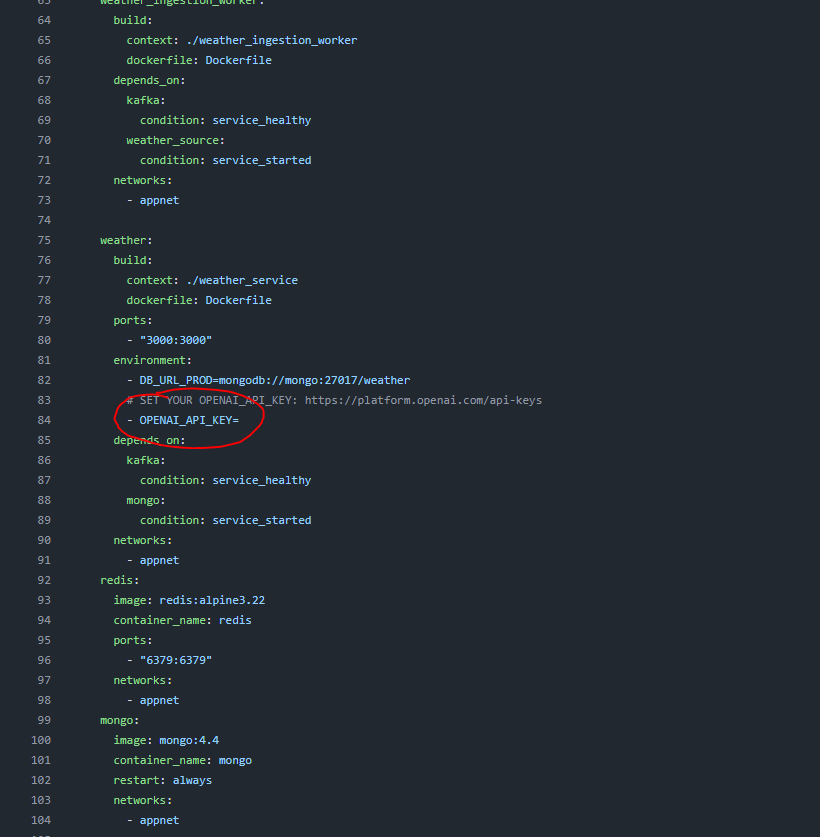
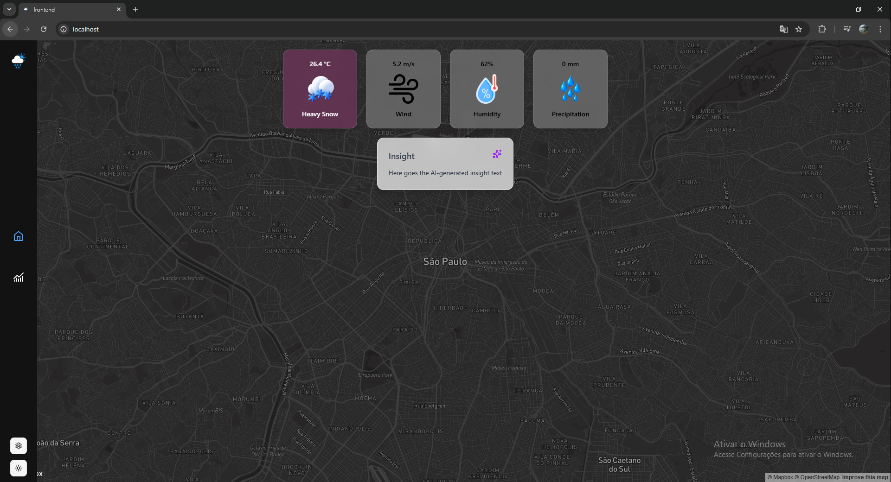

# Desafio GDASH / Luiz Felipe Romero de Azevedo
## Antes de executar a aplicação
Para gerar Insights de IA, é necessário adicionar sua chave de acesso da OPENAI (https://platform.openai.com/api-keys)
Adicione sua chave de acesso em docker-compose.yml


## Como executar a aplicação
No diretório raíz do projeto
```
docker compose up
```
Acesse a aplicação no seu navegador em: http://localhost:80


